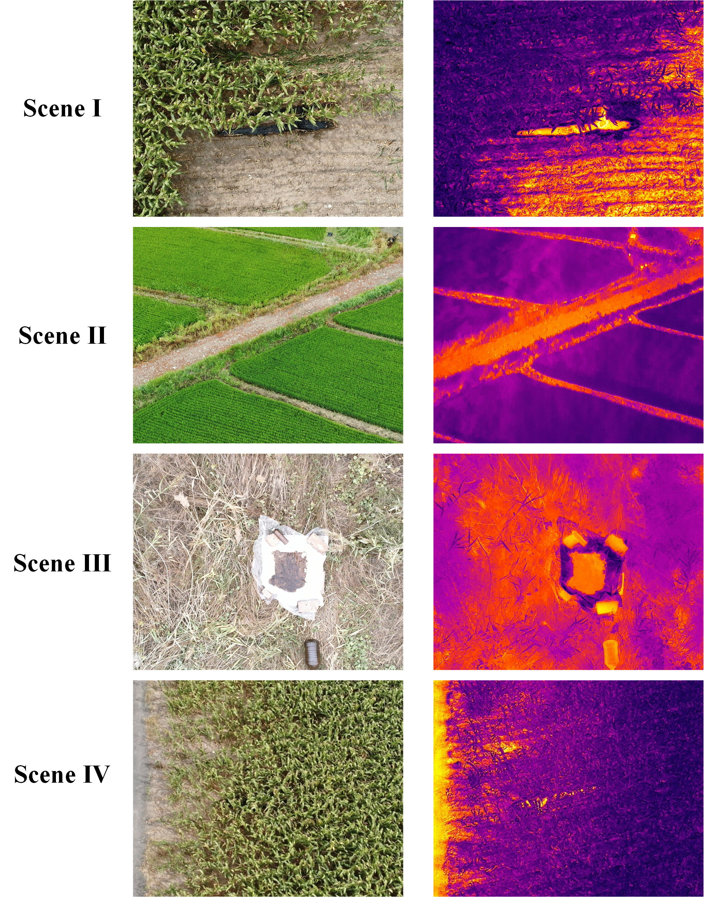

# OilleakDataset
 Oilleak is a dual-modal oil spill dataset collected by UAVs, featuring paired RGB and thermal-infrared images for object detection. We are in the process of organizing the dataset, code, and documentation. Thank you for your interest — updates to the repository will be available soon.

## 🖼️ Figures (displays some data in the dataset)
 

## ⚙️ Usage Instructions
### 1. Environment Dependencies
 The provided requirements.txt file contains the dependencies for our conda environment; you can refer to it for necessary libraries. Alternatively, you can simply run：
 `pip install -r requirements.txt`
### 2. Data
**The OilleakDataset comprises registered RGB and TIR (Thermal Infrared) image pairs.**

Cloud drive link: coming soon~

The dataset structure is as follows:

* The `images` folder holds the **RGB images**.
* The `irimages` folder contains the corresponding **TIR images**.
* The `label` folder provides the **YOLO format label files**: `[class_id, x1, y1, x2, y2, x3, y3, x4, y4]`.

### 3. 🚀 Training

